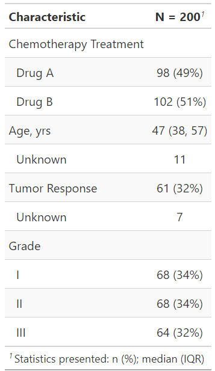
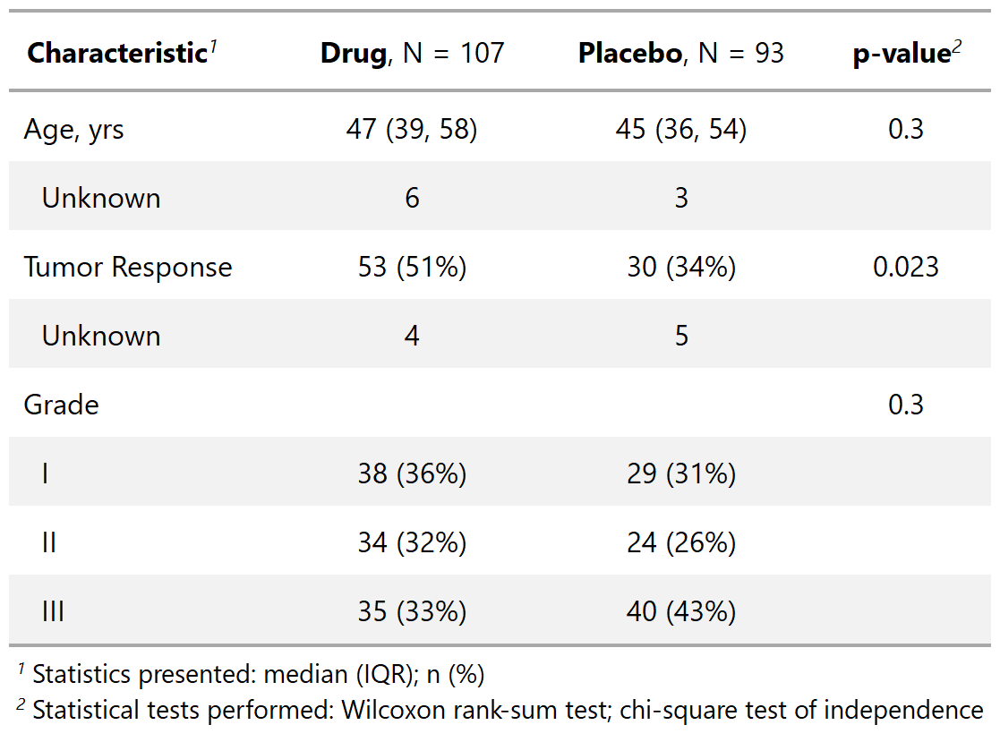
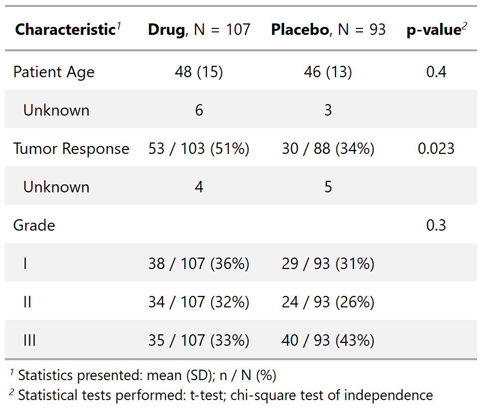

class: inverse, center, middle
# tbl_summary()


---
# {gtsummary} summarize data with tbl_summary()
.pull-left[
.large[**Example: Summarizing clinical trial data**]

Produce a table of descriptive statistics using one line of code:

```{r, results = FALSE}
tbl_summary(sm_trial) #<<
```
```{r, include=FALSE}
# tbl_summ_1a <- sm_trial %>% tbl_summary()
# gtsave(tbl_summ_1a %>% as_gt(), filename = "images/tbl_summary_1a.png")
```

Notice some nice default behaviors:
- Detects variable types of input data and calculates descriptive statistics
  - Default statistics are median (IQR) for continuous variables, and n (percent) for categorical data.
- By default, variables coded as 0/1, TRUE/FALSE, and Yes/No are presented dichotomously.
- Recognizes `NA` values as "missing" and lists them as unknown
- Label attributes automatically printed
- Variable levels indented and footnotes added _({gt})_

]
.pull-right[
<p align="center"></p>
]

???
- This is an abbreviated version of the example data used in the package help files/documentation. 

- Returns a nicely formatted table with sensible rounding and formatting

---
# {gtsummary} summarize data with tbl_summary()
.pull-left[
### **Start customizing using arguments and pipe operator `%>%` to string additional functions together**

```{r, results = FALSE}
tbl_summary_1 <- sm_trial %>%
  tbl_summary(by = trt) %>% #<<
  add_p() #<<

```
```{r, include=FALSE}
# gtsave(tbl_summary_3 %>% as_gt(), filename = "images/tbl_summary_3.png")
```
.medium[
- `by =` argument to split table by a categorical variable
- `add_p()` - default tests are the Wilcoxon rank-sum test for continuous variables, chi-square test of independence/ Fisher's exact test for categorical (Fisher's for low expected counts).
- `add_overall()` - to add back in an overall summary of the data (not split by the `by` argument)


]
]
.pull-right[
<br>
<br>
<p align="center"></p>
]

???
- Go slow here

- summarizing a data set is the MOST important analysis

- summarize data first!  you will often catch mistakes.  Data is complicated, and understanding it up front is important.

- Communicating a summary of the data ALONG with analytic results in necessary (others may catch mistakes you're not aware of)

- {gtsummary} is for presenting results, other great packages are available for summarizing data for your self (e.g. skimr)

- just one line of code

- all functions beginning with `tbl_*` create a new tables

- this is how I used the package 95% percent of the time...so easy

- three types of data shown here (explain them)

---
# {gtsummary} summarize data with tbl_summary()

.pull-left[
.large[
**Customize further using formula syntax and tidy selectors**
]

```{r, results = FALSE}
tbl_summary_3 <- sm_trial %>%
  tbl_summary(
    by = trt,
    statistic = list(
      all_continuous() ~ "{mean} ({sd})", #<<
      all_categorical() ~ "{n} / {N} ({p}%)"), #<<
    label = vars(age) ~ "Patient Age") %>% #<<
  add_p(test = all_continuous() ~ "t.test") #<<
```
```{r, include=FALSE}
# gtsave(tbl_summary_3 %>% as_gt(), filename = "images/tbl_summary_3.png")
```

.medium[
- `statistic` - Report mean and standard deviation for continuous (default is median)
- `label` - Specify label for age
- `type` - Specify variable types
- `digits` - Specify number of decimals to round to
- `test`  [`add_p()`] - Report t-test p-values all continuous (default is Wilcoxan Rank Sum)
]
]
.pull-right[
<p align="center"></p>
]

???

- defaults are great, let's change the default behavior

- statistics can be changed to anything...literally any R function (e.g. variance)

- discuss the formula notation
    - it's like `case_when()`, condition/variable on LHS and result on RHS
    - one formula doesn't need to be in a list, but more than one must be listed

- the vignette has more examples


---

# {gtsummary} tbl_summary() Formulas
.large[
**Formulas**


- Most arguments to `tbl_summary()` require formula syntax, and provide many more options to easily select the table variables you want to modify. More on that later.
<br>
<br>

.center[

**select variables ~ specify what you want to do** 
]
]

???
- case_when uses similar syntax 

---
# {gtsummary} summarize data with tbl_summary()

.large[
**Additional `tbl_summary` Features**
]

.medium[
- Use **{tidyselect}** functions to select variables for customization
- Use **custom functions** for calculating p-values and reporting any statistic for continuous variables (inlcuding user-written functions)
- **Missing data** options
- **Sort variables** by significance (`sort_p()`); sort categorical variables by frequency  
- Calculate **cell percents and row percents** (default is column-wide)  
- Only report p-values for select variables (`add_p(include = ...)`); report q-values (like false discovery rate)  
- **Rounding options** and ability to **set global options** for rounding p-values
]

.large[
 Review [`tbl_summary()` vignette](http://www.danieldsjoberg.com/gtsummary/articles/tbl_summary.html) for more details and examples!
]

???
- There is more I'm not covering here. Many options in the vignette.


