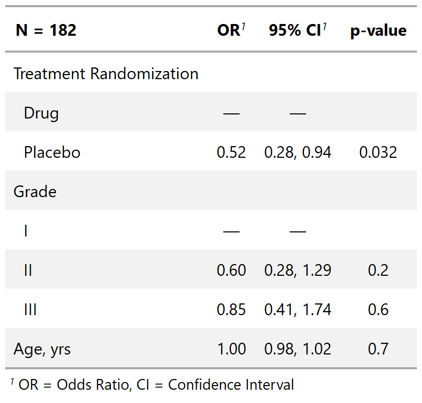
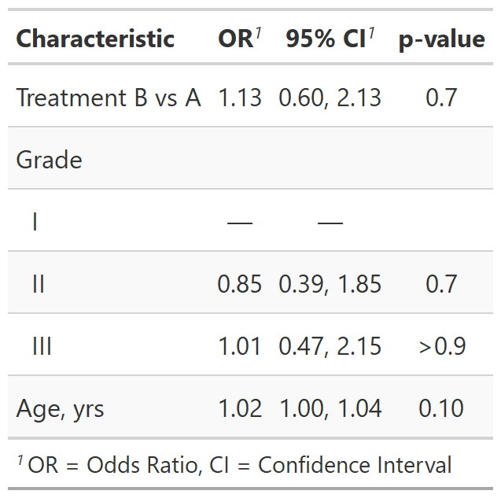
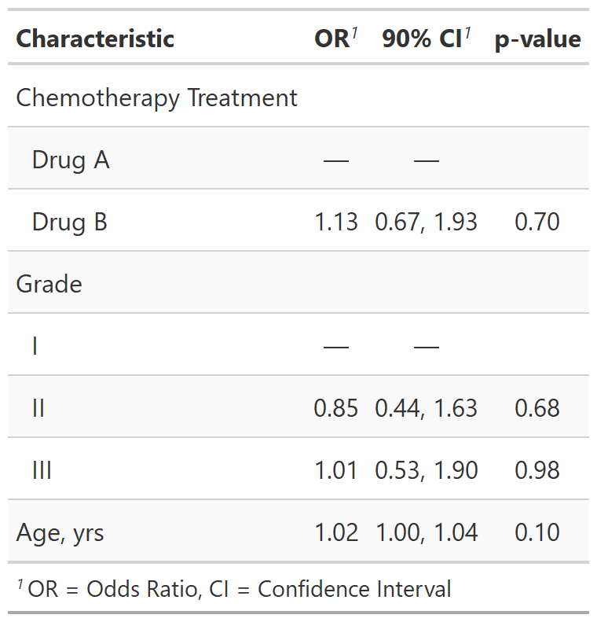
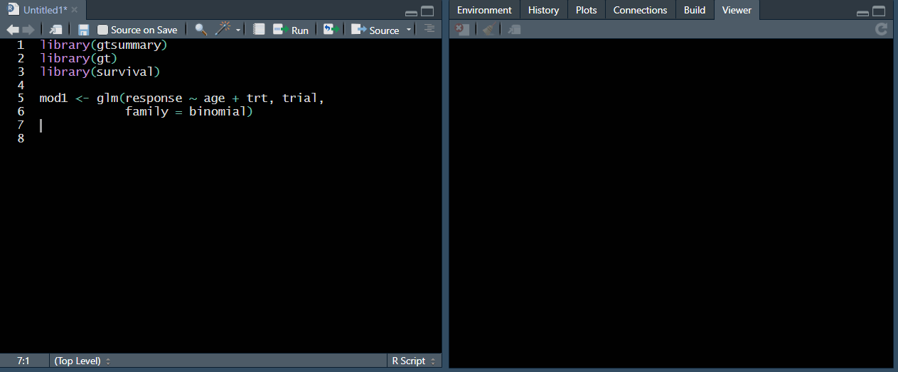
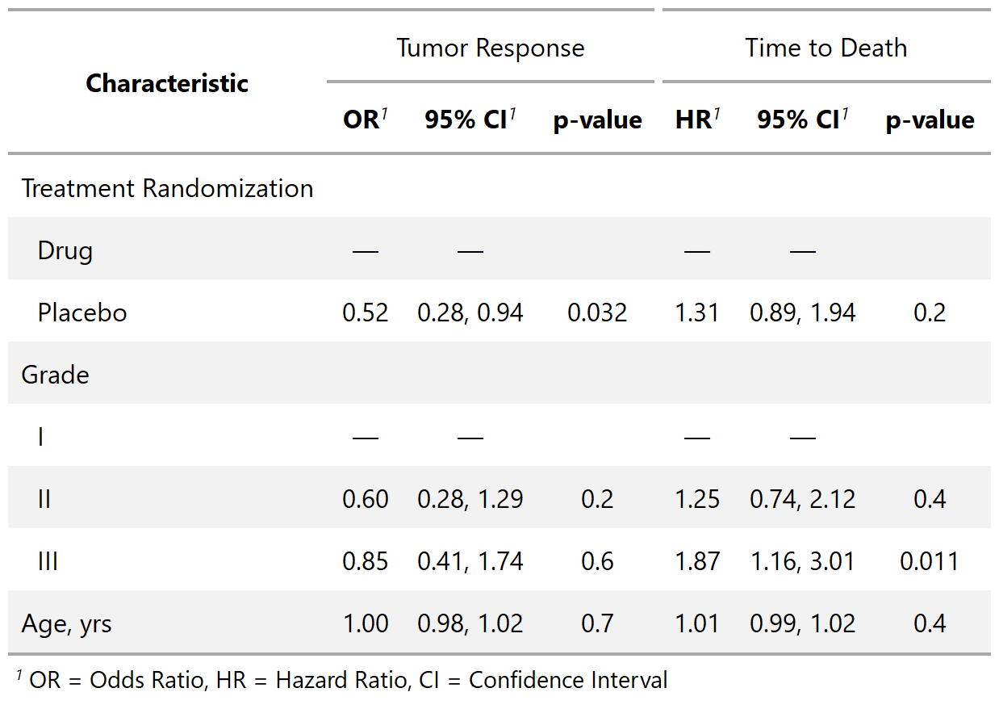
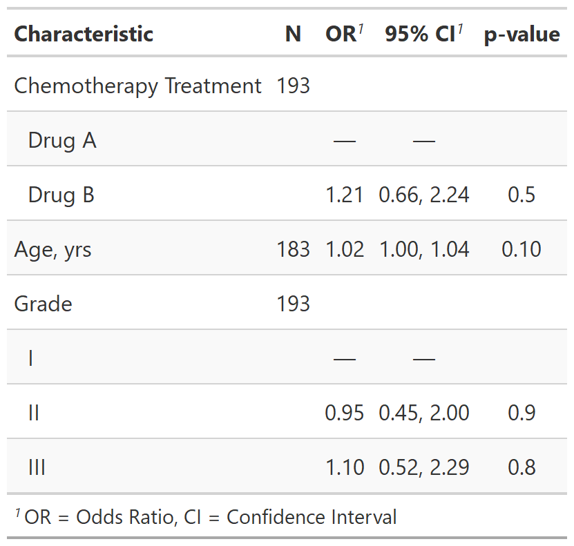

class: inverse, center, middle
# tbl_regression()

---
# {gtsummary} summarize models with tbl_regression()

.pull-left[
.large[
**Raw model output**

⚠ Difficult to work with

⚠ Format varies from different types of models

⚠ Need to exponentiate betas to get odds ratios from a logistic regression etc.
]
]

.pull-right[
```{r}
m1 <- glm(response ~ trt + grade + age, 
          data = trial,
          family = binomial) 
m1 #<<
```
]


???

- it's not pretty

- most often I want the odds ratios from a logistic regression, not the betas

- format from every type of model is different and difficult to work with
---
# {gtsummary} summarize models with tbl_regression()


.pull-left[
.large[

**`broom::tidy()` output**

♥ Using `broom::tidy()` a step in the right direction!

♥ All models returned with consistent table format (term, estimates, standard errors...)

♥ Option to exponentiate

⚠ Does not include reference groups

⚠ Needs additional modification before it can be presented 
]
]

.pull-right[
```{r}
broom::tidy(m1, conf.int = TRUE, exponentiate = TRUE) #<<
```
]

???

- MUCH MUCH better!

- all models returned with consistent format

- but does not include reference groups

- still needs additional modification before it can be presented
---
# {gtsummary} summarize models with tbl_regression()

.pull-left[
### **{gtsummary} Output**
.large[
`tbl_regression()` accepts regression model object as input. Uses {broom} in the background, outputs table with nice defaults:

  ♥ Reference groups added to the table  
  ♥ Sensible default number rounding and formatting  
  ♥ Label attributes printed  
  ♥ Certain model types detected  
  ♥ Estimate header and footnote included 

]
]

.pull-right[

```{r, results = FALSE}
tbl_reg_1 <- tbl_regression(m1, exponentiate = TRUE) #<<
```
```{r, include=FALSE}
# gtsave(tbl_reg_1 %>% as_gt(), filename = "images/tbl_regression_1.png")
```

<p align="center"></p>
]
???
- This table is ready for publication in a single line of code!

- That is something no other package I know of can do

- The back end for the function is {broom} and {gt}, meaning that there is broad support for most regression model types, and the resulting tables are gorgeous and customizable.

- Common regression models, such as logistic regression and Cox regression, are automatically identified and the tables are created with appropriate headers. 

- build the regression model on your own....we are not in the business of model estimation or checking

---
# {gtsummary} summarize models with tbl_regression()

.pull-left[
.large[
**Format variables with `tbl_regression` arguments**
- `label` - Specify labels
- `show_single_row` - If variable is dichotomous (e.g. Yes/No), you can choose to print regression coefficient on a single row
]]

.pull-right[
```{r, results = FALSE}
tbl_reg_1a <- tbl_regression(
  m1, 
  show_single_row = trt, #<<
  label = trt ~ "Treatment B vs A", #<<
  exponentiate = TRUE)
```
```{r, include=FALSE}
#gtsave(tbl_reg_1a %>% as_gt(), filename = "images/tbl_regression_1a.png")
```
<p align="center"></p>
]

---
# {gtsummary} summarize models with tbl_regression()

.pull-left[
.large[
**Format values with `tbl_regression` arguments**
- `exponentiate` - default is `FALSE`
- `conf.level` - Specify between 0-1. Default 0.95.
- `estimate_fun`, `pvalue_fun` - Specify functions to round and format values
- `tidy_fun` - Specify a specific or custom tidier (e.g. use `summary(object, type = "tidy")` from the {mice} package)
]
]

.pull-right[
```{r, results = FALSE}
tbl_reg_1b <- tbl_regression(
  m1, 
  conf.level = 0.9, #<<
  pvalue_fun = function(x) style_pvalue(x, digits = 2), #<<
  exponentiate = TRUE)
```
```{r, include=FALSE}
#gtsave(tbl_reg_1b %>% as_gt(), filename = "images/tbl_regression_1b.png")
```
<p align="center"></p>
]

---
# {gtsummary} summarize models with tbl_regression()



---
# {gtsummary} summarize models with tbl_regression()

.pull-left[
```{r, results = FALSE}
library(survival)
tbl_reg_3 <- 
  coxph(Surv(ttdeath, death) ~ trt + grade + age, 
        data = trial) %>%
  tbl_regression(exponentiate = TRUE)
tbl_reg_4 <-
  tbl_merge( #<<
    tbls = list(tbl_reg_1, tbl_reg_3), #<<
    tab_spanner = c("**Tumor Response**", "**Time to Death**") #<<
  ) #<< 
```
```{r, include=FALSE}
#gtsave(tbl_reg_4 %>% as_gt(), filename = "images/tbl_regression_4.png")
```
.large[
- Build Cox regression model with same predictors as previous model.

- Merge the two regression models with the same predictors and present results side-by-side.
]
]
.pull-right[
<p align="center"></p>
]

???

- side-by-side regression results is common in cancer research (e.g. time to recurrence, then time to death)

- stacking two or more models is also possible

- easy to create custom tables that are formatted beautifully
---
# {gtsummary} summarize data with tbl_uvregression()

.pull-left[
```{r, results = FALSE}
library(survival)
tbl_uvregression_1 <- 
  tbl_uvregression( #<<
    sm_trial, #<<
    method = glm, #<<
    y = response, #<<
    method.args = list(family = binomial), #<<
    exponentiate = TRUE #<<
  ) #<<
```
```{r, include=FALSE}
# gtsave(tbl_uvregression_1 %>% as_gt(), filename = "images/tbl_uvregression_1.png")
```
.large[
- Table of univariate regression models
- Specify the outcome, and the remaining variables in data frame serve as predictors
- Customize table similar to `tbl_regression()`
]
]
.pull-right[
<p align="center"></p>
]

???

- Tables of univariate results can be good for exploratory analysis

- Code is similar to {ggplot2} `geom_smooth()` and `stat_smooth()`

- also great with time-to-event endpoint when you cannot do a `tbl_summary()` to get bivariate p-values

---
class: inverse, center, middle
# inline_text()

---
# {gtsummary} reporting results with inline_text()
.large[
- Tables are important, but we often need to report results in-line in a report.

- Any statistic reported in a {gtsummary} table can be extracted and reported in-line in a R Markdown document with the `inline_text()` function.

```{r, comment=""}
inline_text(tbl_reg_1, variable = trt, level = "Drug B")
```

- The pattern of what is reported can be modified with the `pattern = ` argument.  

- Default is `pattern = "{estimate} ({conf.level*100}% CI {conf.low}, {conf.high}; {p.value})"`.
]

???

- discuss importance of reproducible results

- data is constantly updating

- this functionality assures you won't miss updating a reported estimate in a document

- for me, this is one the most powerful parts of the {gtsummary} package

- something I've never seen in another package
