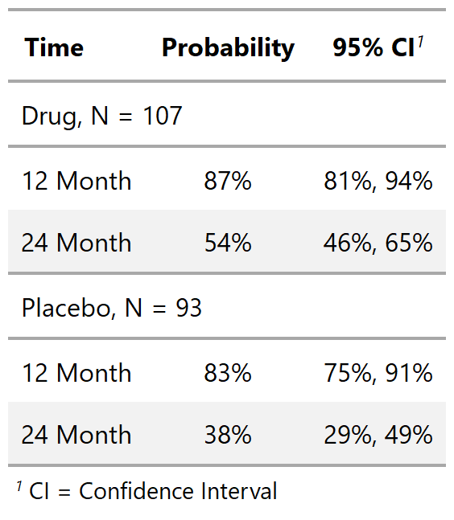

class: inverse, center, middle
# tbl_regression()

---
# {gtsummary} summarize models with tbl_regression()

### Raw Output
```{r}
m1 <- glm(response ~ trt + grade + age, data = trial, family = binomial) #<<
m1
```

???

- it's not pretty

- most often I want the odds ratios from a logistic regression, not the betas

- format from every type of model is different and difficult to work with
---
# {gtsummary} summarize models with tbl_regression()

### {broom} Output
```{r}
broom::tidy(m1, conf.int = TRUE, exponentiate = TRUE) #<<
```

???

- MUCH MUCH better!

- all models returned with consistent format

- but does not include reference groups

- still needs additional modification before it can be presented
---
# {gtsummary} summarize models with tbl_regression()

### {gtsummary} Output
```{r, results = FALSE}
tbl_regression_1 <- tbl_regression(m1, exponentiate = TRUE) #<<
```
```{r, include=FALSE}
# gtsave(tbl_regression_1 %>% as_gt(), filename = "images/tbl_regression_1.png")
```

.pull-left[.large[
- `tbl_regression()` accepts regression model object as inputs.

- Reference groups added to the table.

- Logistic regression model with odds ratio header and footnote.
]]

.pull-right[
<p align="center"></p>
]
???
- This table is ready for publication in a single line of code!

- That is something no other package I know of can do

- The back end for the function is {broom} and {gt}, meaning that there is broad support for most regression model types, and the resulting tables are gorgeous and customizable.

- Common regression models, such as logistic regression and Cox regression, are automatically identified and the tables are created with appropriate headers. 

- build the regression model on your own....we are not in the business of model estimation or checking


---
# {gtsummary} summarize models with tbl_regression()

.pull-left[
```{r, results = FALSE}
library(survival)
tbl_regression_3 <- 
  coxph(Surv(ttdeath, death) ~ trt + grade + age, 
        data = trial) %>%
  tbl_regression(exponentiate = TRUE)
tbl_regression_4 <-
  tbl_merge( #<<
    tbls = list(tbl_regression_1, tbl_regression_3), #<<
    tab_spanner = c("Tumor Response", "Time to Death") #<<
  ) #<< 
```
```{r, include=FALSE}
# gtsave(tbl_regression_4 %>% as_gt(), filename = "images/tbl_regression_4.png")
```
.large[
- Build Cox regression model with same predictors as previous model.

- Merge the two regression models with the same predictors and present results side-by-side.
]
]
.pull-right[
<p align="center"></p>
]

???

- side-by-side regression results is common in cancer research (e.g. time to recurrence, then time to death)

- stacking two or more models is also possible

- easy to create custom tables that are formatted beautifully
---
# {gtsummary} summarize data with tbl_uvregression()

.pull-left[
```{r, results = FALSE}
library(survival)
tbl_uvregression_1 <- 
  tbl_uvregression( #<<
    sm_trial, #<<
    method = glm, #<<
    y = response, #<<
    method.args = list(family = binomial), #<<
    exponentiate = TRUE #<<
  ) #<<
```
```{r, include=FALSE}
# gtsave(tbl_uvregression_1 %>% as_gt(), filename = "images/tbl_uvregression_1.png")
```
.large[
- Table of univariate regression models.

- Specify the outcome, and the remaining variables in data frame serve as predictors.
]
]
.pull-right[
<p align="center"></p>
]

???

- Tables of univariate results can be good for exploratory analysis

- Code is similar to {ggplot2} `geom_smooth()` and `stat_smooth()`

- also great with time-to-event endpoint when you cannot do a `tbl_summary()` to get bivariate p-values

---
class: inverse, center, middle
# tbl_survival()

---
# {gtsummary} summarize data with tbl_survival()
.pull-left[
```{r, plot-last-surv, fig.show = 'hide'}
fit1 <- survfit(Surv(ttdeath, death) ~ trt, #<<
                data = trial) #<<

survminer::ggsurvplot(
  fit = fit1, 
  xlab = "Months",
  ylab = "Overall survival probability",
  legend.title = "Treatment Group",
  legend.labs = c("Drug", "Placebo"),
  break.x.by = 6, 
  censor = FALSE,
  risk.table = TRUE,
  risk.table.y.text = FALSE
)
```
]

.pull-right[
```{r, ref.label = 'plot-last-surv', echo = FALSE}
```
]

???

- You've probably seen something like this before

- It's a Kaplan-Meier curve.  It shows the probability of being free from an event (e.g. cancer recurrence after treatment)

- we can use {gtsummary} to grab estimates from curves like this
---
# {gtsummary} summarize data with tbl_survival()

.pull-left[
```{r, results = FALSE}
tbl_survival_1 <- fit1 %>%
  tbl_survival(times = c(12, 24), #<<
               label = "{time} Month") #<<
```
```{r, include=FALSE}
# gtsave(tbl_survival_1 %>% as_gt(), filename = "images/tbl_survival_1.png")
```

- First, use `survfit()` to estimate survival times.

- Create table of estimates with `tbl_survival()`.

- Can use this function to print survival quantiles as well, e.g. median survival.

```{r, results = FALSE}
fit2 <- survfit(Surv(ttdeath, death) ~ 1, 
                data = trial)
tbl_median_survival <- fit2 %>%
  tbl_survival(probs = c(0.5),
               header_estimate = "**Months**",
               label = "Median Survival")
```
]
.pull-right[
<p align="center"></p>
]

---
class: inverse, center, middle
# inline_text()

---
# {gtsummary} reporting results with inline_text()
.large[
- Tables are important, but we often need to report results in-line in a report.

- Any statistic reported in a {gtsummary} table can be extracted and reported in-line in a R Markdown document with the `inline_text()` function.

```{r, comment=""}
inline_text(tbl_regression_1, variable = "trt", level = "Drug A")
```

- The pattern of what is reported can be modified with the `pattern = ` argument.  

- Default is `pattern = "{estimate} ({conf.level*100}% CI {conf.low}, {conf.high}; {p.value})"`.
]

???

- discuss importance of reproducible results

- data is constantly updating

- this functionality assures you won't miss updating a reported estimate in a document

- for me, this is one the most powerful parts of the {gtsummary} package

- something I've never seen in another package
