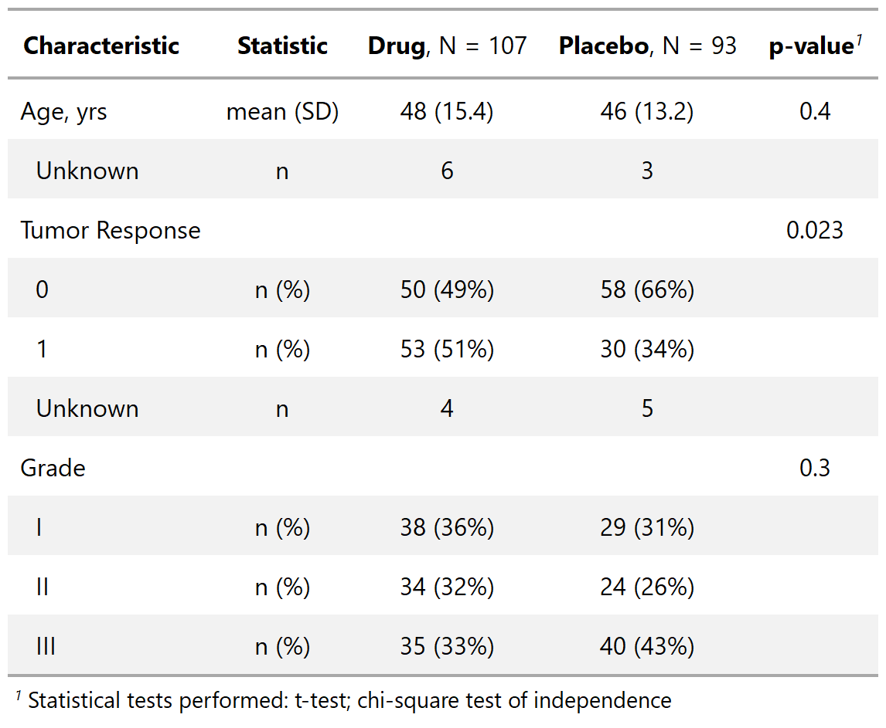
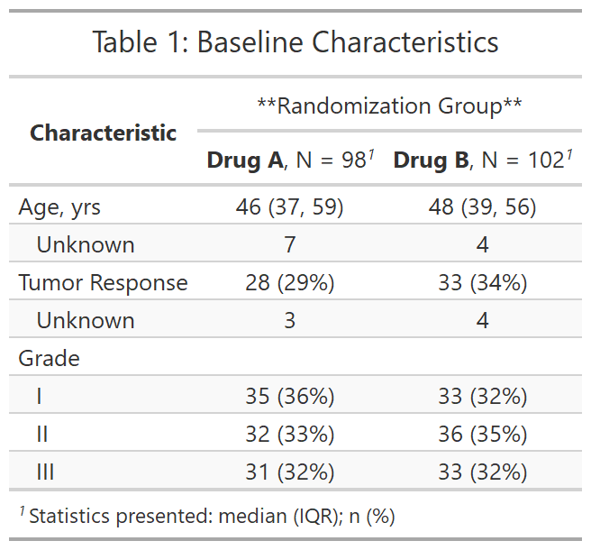

class: inverse, center, middle
# Customization

---
# {gtsummary} tbl_summary() Formulas
.large[
**Formulas**


- Most arguments to `tbl_summary()` require formula syntax, and provide many more options to easily select the table variables you want to modify.   

.center[

<br>

**select variables ~ specify what you want to do** 

]

```{r, eval = FALSE}
tbl_summary(
  trial,
  by = trt,
  statistic = age ~ "{mean} ({sd})" 
)

```
]


---
# {gtsummary} tbl_summary() Formulas
.large[
**Formulas**
.center[

**select variables ~ specifiy what you want to do** 
]

- **select variables**
    - use quoted or unquoted variables, minus sign to negate (e.g. `age` or `"age"` to select, `-age` to deselect)
    - use any {tidyselect} functions, e.g. `contains("stage") ~ ...`, including type selectors (available in next version of {dplyr})
    
- **specify what you want to do** (depends on the argument)
    - change the statistic you report using [{glue}](https://github.com/tidyverse/glue) syntax where whatever in the curly brackets gets evaluated and passed directly into the string. e.g `statistic = ... ~ "{mean} ({sd})"`
    - pass a string to change labels 
]

---
# {gtsummary} tbl_summary() Formulas

.pull-left[
```{r, results = FALSE}
tbl_summary_4 <- sm_trial %>%
  tbl_summary(
    by = trt,
    type = response ~ "categorical",  #<<
    statistic = all_continuous() ~ "{mean} ({sd})",  #<<
    digits = age ~ c(0, 1)  #<<
  ) %>%
  add_p(test = list(all_continuous() ~ "t.test",
                    response ~ "fisher.test")) 
```
```{r, include=FALSE}
# gtsave(tbl_summary_4 %>% as_gt(), filename = "images/tbl_summary_4.png")
```

???

.large[
- Report levels for the response variable.
- Report mean instead of median (using glue)
- Modify the default rounding for age.
- Specify t-test for all continuous variables and Fisher's test for response variable.


]
]
.pull-right[
<p align="center"></p>
]


- further discuss formula notation
    - just like {gt} can use both select helpers OR characters vector of names

- discuss digits and how it's used

- discuss `stat_label = `, and mention the footnote was omitted

---
# {gtsummary} tbl_summary() advanced customization
.large[**Advanced Customization Using {gt}**

- It's natural a {gtsummary} package user would want to customize the aesthetics of the table with one or more of the many {gt} functions available.  

- Every function in {gt} is available to use with a {gtsummary} object.

    1. Create a {gtsummary} table.

    1. Convert the table to a {gt} object with the `as_gt()` function.

    1. Continue formatting as a {gt} table with any {gt} function.
]

???

Discuss `as_gt()` and how to use


---
# {gtsummary} tbl_summary() advanced customization
.large[**Advanced Customization Using {gt}**

- tab_header() - add a table title

- tab_spanner() - add headers that span columns

- tab_options() - change table padding and font size

- tab_footnote() - add additional footnotes to table

And many more! https://gt.rstudio.com/
]

---
# {gtsummary} advanced customization

.pull-left[
.large[**Advanced Customization Using {gt}**]

```{r, results = FALSE}
tbl_summary_5 <- sm_trial %>%
  tbl_summary(by = trt) %>%
  # convert from gtsummary object to gt object
  as_gt() %>% #<<
  # modify with gt functions
  tab_header("Table 1: Baseline Characteristics") %>% #<<
  tab_spanner(  #<<
    label = "Randomization Group",   #<<
    columns = starts_with("stat_")  #<<
  ) %>% #<<
  tab_options(  #<<
    table.font.size = "small",  #<<
    data_row.padding = gt::px(1))  #<<
```
```{r, include=FALSE}
# gtsave(tbl_summary_5, filename = "images/tbl_summary_5.png")
```

.footnote[More on this in the `tbl_summary()` <a href="http://www.danieldsjoberg.com/gtsummary/articles/tbl_summary.html#advanced-customization">vignette</a>]
]
.pull-right[
<p align="center"></p>
]

---
# {gtsummary} advanced customization: global options

.large[Have a consistent rounding preference or gt styling you want to apply all the time?

Set some **global options** at the top of your RMD or in your .Renviron!
]

## Format {gt} tables
For example, to make all your tables have small font size and minimal row padding (for more "compact" tables): 

`options(gtsummary.as_gt.addl_cmds = "gt::tab_options(table.font.size = 'small', data_row.padding = gt::px(1))")`

## Style Estimates and p-values
For example, always round p-values to 2 digits:

`options(gtsummary.pvalue_fun = function(x) style_pvalue(x, digits = 2))` 


Check out the [Global Options](http://www.danieldsjoberg.com/gtsummary/articles/global_options.html) vignette for more examples. 

