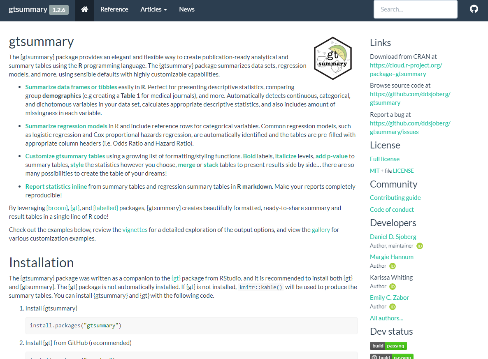
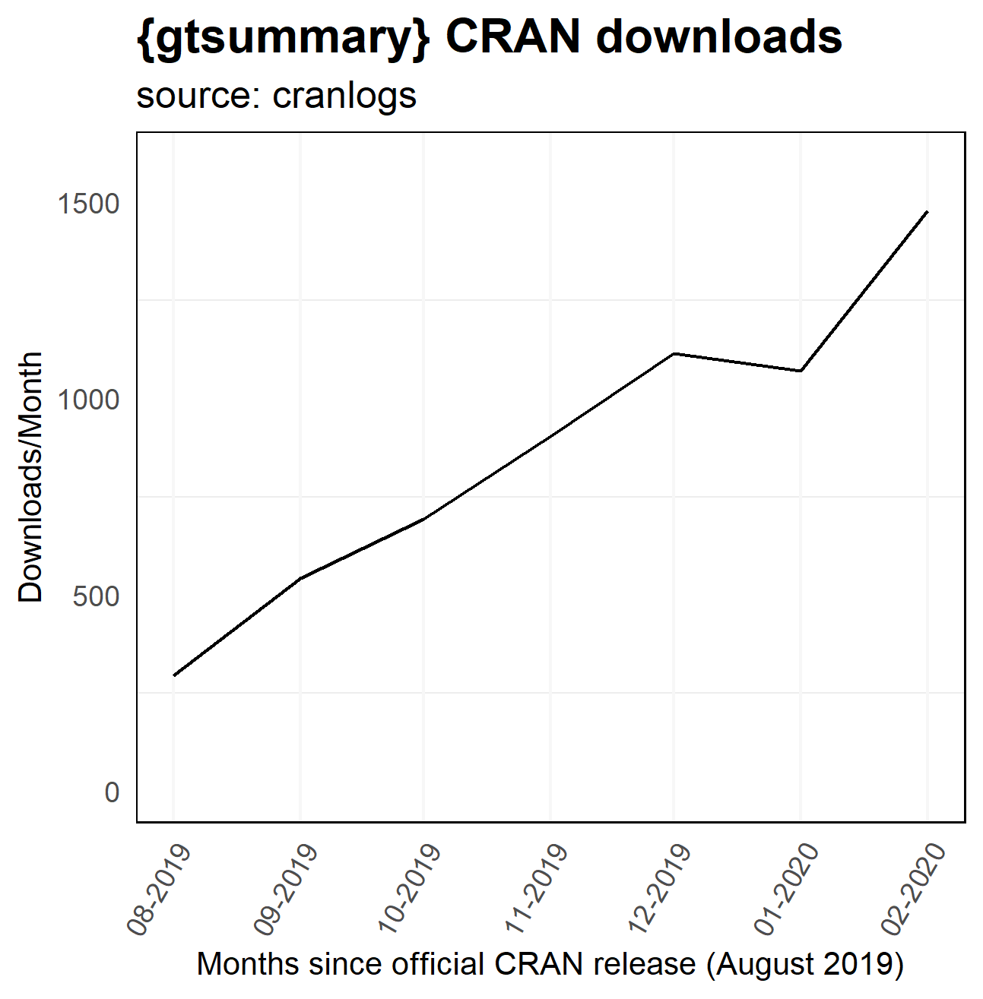

class: inverse, center, middle

# Conclusion

---
# {gtsummary} - Package Website
Website contains [well-documented functions](http://www.danieldsjoberg.com/gtsummary/reference/index.html), detailed [tutorials](http://www.danieldsjoberg.com/gtsummary/articles/), and [examples](http://www.danieldsjoberg.com/gtsummary/articles/gallery.html)!

[](http://www.danieldsjoberg.com/gtsummary/)

???
For live presentation include scrolling iframe
<iframe src="http://www.danieldsjoberg.com/gtsummary/" scrolling= "yes" width = "950%" height = 90%"></iframe>

---

# {gtsummary} Installation

.pull-left[
.medium[

* Install {gtsummary} from **CRAN** with the following code: 

``` {r, eval=FALSE}
install.packages("gtsummary")          
```


* Also recommended to install the development version of {gt} from **GitHub**.

``` {r, eval=FALSE}
install.packages("remotes")
remotes::install_github("rstudio/gt")        
```
  
]
]

.pull-right[

]

???
- visit the website and give quick tour
r include_url("http://www.danieldsjoberg.com/gtsummary/", height = "400px")

* {gtsummary} package website: http://www.danieldsjoberg.com/gtsummary/

  *  Installation instructions
  
  *  Thorough documentation on every function
  
  *  Detailed tutorials 

---

class: center
# Resources
.large[


 {gtsummary} documentation/website/tutorials <a href="http://www.danieldsjoberg.com/gtsummary/">danieldsjoberg.com/gtsummary/</a>

 {gtsummary} package <a href="https://github.com/ddsjoberg/gtsummary">github.com/ddsjoberg/gtsummary</a>

 slides at <a href="https://github.com/margarethannum/gtsummary-presentation-rladies">github.com/margarethannum/gtsummary-presentation-rladies</a>  

 source code for slides at <a href="https://github.com/margarethannum/gtsummary-presentation-rladies">github.com/margarethannum/gtsummary-presentation-rladies</a>

 {gt} package <a href="https://github.com/rstudio/gt">github.com/rstudio/gt</a>
]

Slides created using [xaringan](https://github.com/yihui/xaringan) R package

[R-Ladies xaringan theme](https://alison.rbind.io/post/2017-12-18-r-ladies-presentation-ninja/) from Alison Hill (@apreshill)

```{r include = FALSE, echo=FALSE, eval=FALSE}
library(lubridate)
library(scales)
library(tidyverse)
theme_set(mskRvis::theme_biostat())

dl <- cranlogs::cran_downloads(packages = "gtsummary", from = "2019-08-19", to = "last-day")


dlmonth <- dl %>% 
  group_by(month = floor_date(date, "month")) %>% 
  summarize(amount = sum(count)) %>% 
  filter(month != "2020-03-01")

p <- ggplot(dlmonth, aes(x = month, y = amount)) +
  geom_line() + 
  xlab("") +
  coord_cartesian(ylim = c(0,1600)) +
  labs(
    title = "{gtsummary} CRAN downloads",
    subtitle = "source: cranlogs"
  ) +
  ylab("Downloads/Month") +
  xlab("Months since official CRAN release (August 2019)") +
  scale_x_date(
    date_breaks = "1 month",
    labels = date_format("%m-%Y")) +
  theme(axis.text.x = element_text(angle = 60, hjust = 1))  #+
   # geom_vline(xintercept = as.numeric(as.Date("2019-05-01")),
   #            linetype = 4,
   #            color = "seagreen")
  

#ggsave(p, filename = "images/cranlogs.png")
```


???

Go star {gtsummary} on GitHub...we're already to 50+!


---
# Thank you! 


♥ {gtsummary} Authors: [**Daniel Sjoberg**](http://www.danieldsjoberg.com/) (Maintainer), Margie Hannum, Karissa Whiting


♥ {gtsummary} Contributors: Emily Zabor (not pictured), Michael Curry, Esther Drill, Jessica Flynn, Stephanie Lobaugh

♥ Huge thank you to [Rich Iannone](https://github.com/rich-iannone), the Author/Maintainer of the {gt} package.

♥ And thank you to everyone in Epidemiology and Biostatistics at Memorial Sloan Kettering for testing the package and providing valuable feedback! 

---
# Appendix: {gtsummary} Advanced

.large[
{gtsummary} output is a list that prints as a {gt} table.
]
```{r}
names(tbl_summary_1)
```

```{r}
pluck(tbl_summary_1, "table_body") %>% head()
```


---
# Appendix: {gtsummary} Advanced


```{r}
pluck(tbl_summary_1, "gt_calls") %>% head(n = 4)
```

???

If there is time, review the structure of a {gtsummary} object

Essentially, what is going on is that the {gt} calls on the right are called on the table on the left whenever the object is printed.

Understanding this structure will help you modify if you need.  If there is a {gt} call that formats in a way you don't like, convert your object with `as_gt()` and use the `omit =` argument to leave out the gt call you don't like.

You can replace it with whatever you choose.

<!-- --- -->
<!-- # Customization -->

<!-- ### Additional customization -->
<!-- - **Table footnotes** (you can optionally exclude these using `as_gt(exclude = "footnote_stat_label")` ) -->