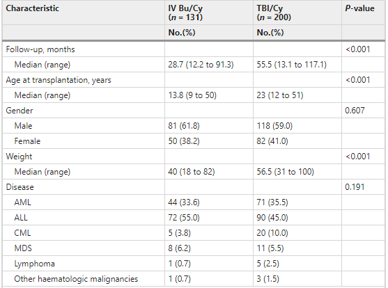
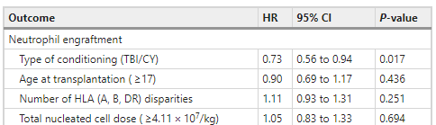
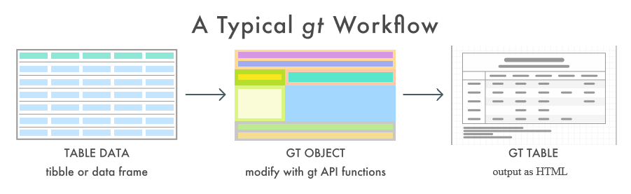
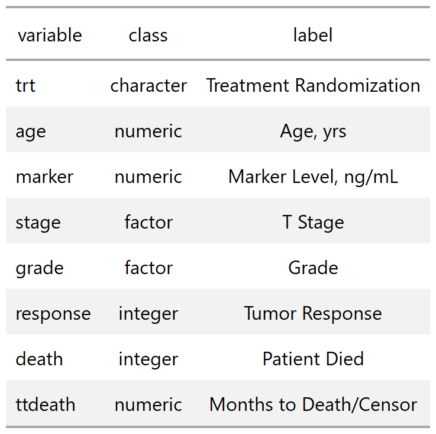

```{r setup, include=FALSE}
# xaringan::inf_mr()
options(htmltools.dir.version = FALSE)
knitr::opts_chunk$set(echo = TRUE, eval = TRUE)
library(tidyverse)
library(rlang)
library(knitr)
library(gtsummary)
library(gt)
set.seed(78987)

theme_set(mskRvis::theme_biostat())

```

class: inverse, left, middle

# **gtsummary**: Creating publication-ready analytical tables

.large[
.pull-left[
**Margie Hannum**

Department of Epidemiology & Biostatistics  
Memorial Sloan Kettering Cancer Center

RLadies NYC, February 26, 2020

.footnote[Twitter: @Margaret-Hannum  Github: @margarethannum ]
]
]


 

---

# Motivation: reproducible, presentation-ready tables



.footnote[<a href="https://www.nature.com/articles/s41409-019-0441-4">Tang et. al, *Bone Marrow Transplantation* (February 2019)</a>]


???
- In our department we make table 1 and summarize regression models all the time. We all had our own siloed way to do this, some people had personal packages and some people just had scripts to do what they wanted. 

- As a department we wanted a unified way to make these tables, nothing out there did exactly what we wanted, with the level of customizability that we wanted. 

-Create reproducible summary and analytic tables that are ready to present. Create demographic tables, summarize regression models, and report analysis results. 

-Other packages out there to create similar tables are opinionated without being very customizable

-What if a collaborator wants 2 decimal places? 3? Mean (Range) for some variables and Median (IQR) for others? Bolding significant p-values? 
A special kind of confidence interval formula instead of the default?

- Often end up doing formatting after-the-fact which is not reproducible! Or, people have their own siloed code to make tables a particular way that they like (also not reproducible and shareable, unless they also make a package)
---

# Motivation: reproducible, presentation-ready tables



.footnote[<a href="https://www.nature.com/articles/s41409-019-0441-4">Tang et. al, *Bone Marrow Transplantation* (February 2019)</a>]


---

# {gtsummary} Overview

.large[
.pull-left[
* Package will create your tabular summaries, with sensible defaults that are highly customizable
  - Summarize data frames/tibbles
  - Summarize regression models
  - Customize tables
  - Report statistics from {gtsummary} tables inline in R Markdown

* Leverages {broom}, {labelled}, {tidyselect}, and {gt} packages to get the job done!

* CRAN version 1.2.6 released 2020-02-13
]
]

.pull-right[

]

---


# Background: {gt}

.large[
.pull-left[
* New package from RStudio

* Package for printing highly customized tables


* Goal is to unify code for creating tables in HTML, Word (via RTF), and PDF

* Check it out! https://gt.rstudio.com/
]
.pull-right[

]
]

???
-Gauge room for who uses kable/gt

-When Dan started developing gtsummary last year it was originally designed for our tables to be printed using knitr::kable(). But mid-last-year Rich Iannone from RStudio started developing a table construction package called {gt}, and even though it’s still in development (and not on CRAN), since it’s from the RStudio world we anticipate it will have full support and eventually be widely adopted, so he switched our package to take full advantage of the functionality {gt} offers. Still can use our package and print with kable, more on that later.

---


# Background: {gt}


.pull-left[.footnote[Image source: https://gt.rstudio.com/]]

???
the gt documentation is great!

all functions grouped by the part of a table they modify

---
# Background: {gt}




.pull-left[.footnote[Image source: https://gt.rstudio.com/]]

???
* Workflow: input dataframe or tibble, create gt object (list with data and formatting elements), output gt table as HTML (previewed in the Viewer).

---
# {gtsummary} Print Engines - gt or kable?
.large[
.pull-left[
## gt

♥ Highly Customizable 

♥ All output includes informative footnotes, indents levels

♥ HTML Output

⚠ PDF Output still in dev

⚠ MS Word Output via RTF still in dev, requires re-sizing of tables by hand
]

.pull-right[
## kable

⚠ Less Customizable 

⚠ Footnotes and spanning headers stripped from all output. No indents.

♥ HTML Output

♥ PDF Output

♥ MS Word Output
]

**We built {gtsummary} as a companion to {gt} and highly recommend it!** 

]

???
.footnote[All examples shown use {gt} print engine]

---
# **trial** dataset overview

.pull-left[

```{r}
head(trial, 3) #<<
```

<p align="center">
]

.medium[
.pull-right[
* Throughout this presentation examples will use the `trial` dataset, included with {gtsummary}. 

* Dataset contains baseline characterstics of 200 patients who received Drug A or Drug B. Includes outcome of tumor response to the treatment. 

* Variables have label attributes assigned using the `labelled` package. 

* For simplicity in this presentation, subset data to a few variables of interest:
```{r, results = FALSE}
sm_trial <- trial %>% #<<
  select(trt, age, response, grade) #<<
```
]
]


---
```{r child='02-tbl_summary.Rmd'}
```

---
```{r child='03-tbl_regression.Rmd'}
```

---
```{r child='05-customization.Rmd'}
```

---
```{r child='06-conclusion.Rmd'}
```

