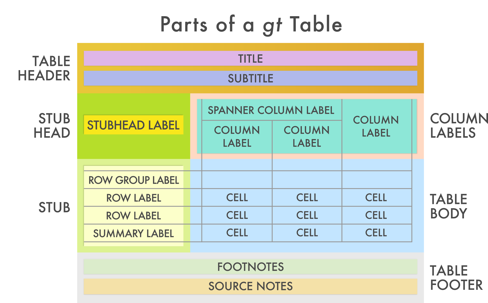

```{r setup, include=FALSE}
# xaringan::inf_mr()
options(htmltools.dir.version = FALSE)
knitr::opts_chunk$set(echo = TRUE, eval = TRUE)
library(tidyverse)
library(rlang)
library(knitr)
library(gtsummary)
library(gt)
set.seed(78987)
```


class: center
background-image: url(images/biostatr_logo.png)
background-size: contain

# {biostatR} package

???
- the same biostatR we all love, but with improvements

---
background-image: url("https://media.giphy.com/media/uELDhoOZdSnUk/giphy.gif")
background-size: contain
# {biostatR} v1.0
 
???
- v1.0 has some exciting updates

- other departments loved bits of what we had done
    - and they stole them
    
    - we exported many of our functions to mskR
      - color palette
      - symbolic links
      - working with MSK github
    
- we wanted the change the structure to share resources across the hospital
---
# {biostatR} v1.0

<p align="center"></p>

???
- the new look of biostatR, similar to the tidyverse

- when you load biostatR, three packages are loaded

- the **mskR** packages are used throughout the hospital

- more people get to use the functions we've written, and we get more functionality that others have written.

---
# {biostatR} v1.0 - Organization

.pull-left[
### gtsummary
- Bulk of the former biostatR lives here

- Data summary functions (e.g. for Table 1), 

- Regression model summary functions

- Functions for reporting results inline

- Rounding/Formatting functions

- Kaplan-Meier summary functions
]

.pull-right[
### mskRvis

- MSK-themed ggplot color palette

- MSK-themed markdown template

- More coming soon...

### mskRutils

- Automated project setup functions

- Setting symbolic links

- Other functions for working with MSK Enterprise GitHub
]

---
# {biostatR} v1.0 - Package Website

.large[
* Package Website: http://biostatR.mskcc.org

  * Installation instructions
  
  * Thorough documentation on every function
  
  * Detailed tutorials 
  
* Install biostatR with the following code
]

``` {r, eval=FALSE}
install.packages("remotes")
remotes::install_git("https://github.mskcc.org/datadojo/biostatR.git")

library(biostatR)
-- Attaching packages ------------------------------ biostatR 1.0.0 --
v gtsummary 1.2.1          v mskRutils 0.2.0     
v mskRvis   0.1.0          
```

???
- visit the website and give quick tour
---
# {gtsummary} Overview

.large[
* Package will create your tabular summaries

* {gt} package is the default table printing engine 
  - customization ☄
  - easy-to-learn ★

* `kable()` from {knitr} may still be used
  - no footnotes ☒
  - no spanning headers ☒
  - fewer customization options ☒
]

---
# {gt} - an aside

.large[
.pull-left[
* New package from RStudio

* Package for printing highly customized tables

* Goal is to unify code for creating tables in HTML, Word (via RTF), and PDF

* Check it out! https://gt.rstudio.com/
]
.pull-right[

]
]

---
# {gt} - an aside
.pull-left[
"We can construct a wide variety of useful tables with a cohesive set of table parts. These include the *table header*, the *stub*, the *stub head*, the *column labels*, the *table body*, and the *table footer*."

]
.pull-right[

]

???
the gt documentation is great!

all functions grouped by the part of a table they modify
---
# {gtsummary} Print Engines - gt or kable?
.large[
.pull-left[
## gt

♥ Highly Customizable 

♥ All output includes informative footnotes

♥ HTML Output

♥ PDF Output

⚠ MS Word Output via RTF, requires re-sizing of tables by hand
]

.pull-right[
## kable

⚠ Less Customizable 

⚠ Footnotes and spanning headers stripped from all output

♥ HTML Output

♥ PDF Output

♥ MS Word Output
]
]
.footnote[All examples shown use {gt} print engine]


# New Features in {gtsummary}

.pull-left[
**`tbl_summary`**

- Use tidyselect and additional selector functions for arguments 

- Sort variables by significance with `sort_p()`

- Accepts custom functions for calculating p-values in `add_p()` 

- Table footnotes indicating statistics presented 

- Calculate column, row, and cell percents in `tbl_summary()`

- Report p-values for selected variables with `add_p(exclude = ...)`

- Improved rounding options and ability to set global options for rounding p-values
]
.pull-right[
**`tbl_regression`**

- Merge and stack regression tables to create complex and custom tables

- Table footnotes defining abbreviations (e.g. OR and CI)

**`tbl_survival` NEW!**

- Summarize Kaplan-Meier analyses

- Summarize competing risk cumulative incidence curves (coming soon!)
]

???
- these are new features many added by request

---
```{r child='02-tbl_summary.Rmd'}
```

---
```{r child='03-tbl_regression.Rmd'}
```

---
class: center
# {biostatR}
.large[
• Every function is documented further in the help file •

• Check out the package website for vignettes including detailed examples and explanations •

 {biostatR} documentation <a href="http://biostatR.mskcc.org/">biostatR.mskcc.org/</a>

 {gtsummary} documentation <a href="http://www.danieldsjoberg.com/gtsummary/">danieldsjoberg.com/gtsummary/</a>

 {gt} documentation <a href="https://gt.rstudio.com/">gt.rstudio.com/</a>

 {mskRvis} documentation <a href="https://github.mskcc.org/pages/datadojo/mskRvis/index.html">github.mskcc.org/pages/datadojo/mskRvis/</a>

 {mskRutils} documentation <a href="https://github.mskcc.org/pages/datadojo/mskRutils/index.html">github.mskcc.org/pages/datadojo/mskRutils/</a>

]
